# Episode Info — IINA Plugin

**Episode and movie info from TMDB, shown as an overlay the moment you pause. Subtitle search across three independent sources, and one-click skipping of intros and credits.**

*Listed in [IINA's official community plugins directory](https://github.com/iina/iina#community-plugins).*

 

  

**Only a free TMDB key required** · **No analytics, no tracking** · **Auto-updates through IINA**

---

## Preview

## Features

- **TMDB-powered episode & movie info** — search any title, see show name, episode title, code, air date, rating, synopsis, and poster
- **Auto-overlay on pause** — info card appears when you pause, vanishes when you resume
- **Three overlay themes** — Classic (full-width card), Compact (a single unobtrusive line), or Poster Focus (a floating card led by the poster)
- **Customizable overlay** — adjustable shade, vertical position (top / center / bottom), and configurable pause delay
- **Skip intro, recap and credits** *(experimental)* — a button appears over the video when there is something to skip. No account or API key needed, but coverage depends on community-contributed data
- **Recent picks & recent searches** — reuse a recent show in one click, or re-run a recent search without retyping it
- **Per-URL memory** — once you identify a video, the show/episode is remembered against that file's URL. Re-open it later, even after restarting IINA, and your pick is restored automatically. Each URL keeps its own remembered identification
- **Three subtitle sources, independent** — OpenSubtitles, SubDL, and Wyzie Subs each with their own search cascade. Combining them dramatically improves coverage, especially for very recent episodes that haven't synced across all databases yet
- **opensubtitles.org website fallback** — one-click button opens the legacy site in your browser when API results are missing for fresh content. Pre-filtered by IMDB ID
- **Per-source manual search** — every subtitle source has its own custom search box, so you can search a different title or release name without losing your selected episode
- **Quick toggles** — show overlay on pause, sidebar dismiss button, one-click clear selection
- **Auto-updates** — install through IINA's plugin manager via GitHub releases and stay current

## Installation

### From GitHub (recommended — gets auto-updates)

1. Open IINA → Preferences → Plugins
2. Click **Install from GitHub...**
3. Enter: `Zain-Imam/iina-episode-info`
4. Click Install

### Manual

Download the latest `.iinaplgz` from [Releases](https://github.com/Zain-Imam/iina-episode-info/releases) and double-click it.

## Setup

### Required — TMDB API Key

1. Get a free key at [The Movie Database](https://www.themoviedb.org) → Settings → API → Developer
2. Open the **Episode Info** tab in IINA's sidebar
3. Paste your key and click Save

### Optional — Subtitle Sources

You can use any combination of the three sources. They search independently, so adding more sources just expands your coverage.

**OpenSubtitles** (5 downloads/day free, 10/day with login):
1. Register at [opensubtitles.com](https://www.opensubtitles.com) → My Account → API Consumers → Create consumer
2. Paste your API key in the sidebar under *Subtitles — OpenSubtitles*
3. Optionally sign in with your username and password for more downloads

**SubDL** (free, no payment):
1. Sign up at [subdl.com](https://subdl.com)
2. Go to [subdl.com/panel/api](https://subdl.com/panel/api) and copy your API key
3. Paste it in the sidebar under *Subtitles — SubDL*

**Wyzie Subs** (free, unlimited, no account needed):
1. Go to [sub.wyzie.io/redeem](https://sub.wyzie.io/redeem) and click Generate
2. Paste the key in the sidebar under *Subtitles — Wyzie Subs*

### Nothing to set up — Skip Intro *(experimental)*

Skip intro works with no account and no API key. Open **Skip Intro & Credits** in the sidebar and turn it on.

> [!NOTE]
> **This feature is experimental and its coverage is still growing.**
>
> Timings are not something the plugin can calculate — they come from open, community-contributed databases, so **it will not work for every movie, show or episode**. Long-running and popular series are covered well; brand-new, niche or regional titles are often missing, and some shows have credits data but no intro. Anime is generally well covered thanks to AniSkip.
>
> These databases grow as people contribute to them, so an episode that finds nothing today may work later — press **Search again** in the sidebar to re-check. If nothing turns up, that episode simply isn't in any of them yet.

> [!TIP]
> OpenSubtitles' modern API sometimes lags days/weeks behind their legacy website for very recent episodes. The plugin shows a *"View on opensubtitles.org →"* button that opens the legacy site in your browser as a manual fallback.

## Usage

1. Open the Episode Info sidebar tab
2. Search for your show or movie and pick the episode
3. Pause the video — the info overlay appears after a short delay
4. Resume — overlay disappears automatically

The next time you open the same file or stream, your identification is restored automatically — no need to search again.

### Skipping intros and credits

Turn on **Skip Intro & Credits** in the sidebar. When playback reaches an intro, recap or the closing credits, a button appears in the corner of the video:

- **Click it**, or press **⌥S** (Option-S), or use *Plugins → Skip Intro / Recap / Credits*
- It never seeks on its own — ignore it and it fades away by itself
- No button appeared? Press **Search again** in the sidebar to look once more

Timings come first from the chapter markers inside your video file, which are exact and need no internet. If the file has none, three free databases — **IntroDB**, **TheIntroDB** and **SkipDB** — are asked at once, and where several agree, that agreement is preferred. Coverage is good for popular shows and thinner for very new or niche ones; the sidebar shows what was found.

### Recent picks and recent searches

Under the search box you'll find:

- **Recent Searches** — your last 5 search terms as chips. Click one to run that search again, which is the quick way to get from one episode to the next
- **Recent Picks** — the last 5 shows or movies you identified. Click one to apply it to whatever is playing now. Use ★ to pin a favourite so it never ages out, or × to remove it

Both are stored only on your Mac.

### Customizing the overlay

The sidebar has controls for:
- **Show Overlay on Pause** — toggle the overlay entirely on/off
- **Overlay Shade** — adjust background darkness (0–100%)
- **Overlay Position** — anchor the card to the top, center, or bottom of the video
- **Theme** — Classic, Compact, or Poster Focus
- **Pause Delay** — change how many seconds to wait after pausing before the overlay appears
- **Clear selection** — forget the saved identification for the current video so you can re-identify it

All of these settings persist across IINA restarts.

## Privacy

This plugin only contacts:
- `api.themoviedb.org` / `image.tmdb.org` — for episode/movie info and posters
- `api.opensubtitles.com` — for subtitle search/download (optional)
- `api.subdl.com` / `dl.subdl.com` — for subtitle search/download (optional)
- `sub.wyzie.ru` / `sub.wyzie.io` — for subtitle search (optional)
- `api.introdb.app` / `api.theintrodb.org` / `api.skipdb.tv` — for intro and credit timings (only when Skip Intro is on)
- `arm.haglund.dev` / `api.aniskip.com` — to look up anime openings and endings (only when Skip Intro is on)

All API keys are stored locally in IINA's sandboxed WebView and never shared. No analytics or tracking of any kind.

## Requirements

- IINA 1.4.0 or later
- macOS 12 or later
- Free TMDB API key ([get one here](https://www.themoviedb.org/settings/api))

## Changelog

See the [Releases page](https://github.com/Zain-Imam/iina-episode-info/releases) for the full version history and detailed release notes.
